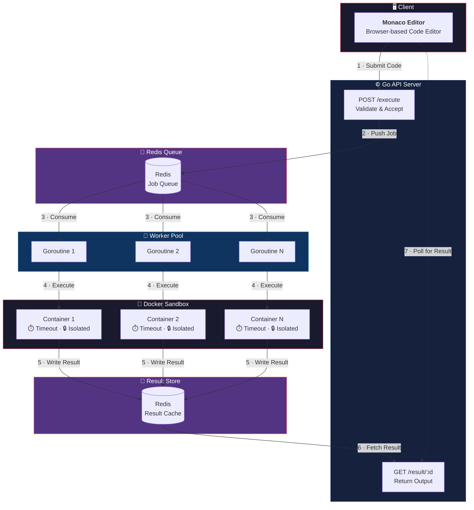
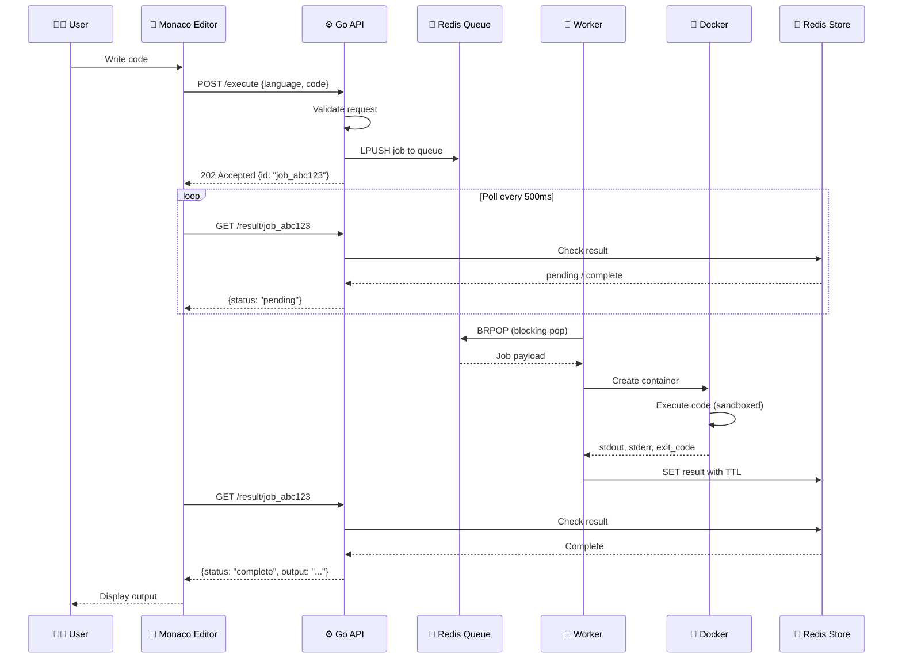

<p align="center">
  
  
  
  
</p>

<h1 align="center">⚡ Nikium IDE</h1>

<p align="center">
  <strong>A blazing-fast, cloud-based code execution IDE</strong><br/>
  <em>Write code in the browser. Execute it in isolated Docker sandboxes. Get results in real time.</em>
</p>

<p align="center">
  <a href="#-architecture">Architecture</a> •
  <a href="#-tech-stack">Tech Stack</a> •
  <a href="#-getting-started">Getting Started</a> •
  <a href="#-api-endpoints">API</a> •
  <a href="#-security">Security</a>
</p>

---

## 🏗️ Architecture

### System Overview



### Request Lifecycle



---

### Execution Flow — Step by Step

| Step | Component | Action |
|:----:|:---------:|--------|
| **1** | 🖥️ Frontend | User writes code in Monaco Editor and hits **Run** |
| **2** | ⚙️ API Server | `POST /execute` validates the payload and enqueues a job |
| **3** | 📨 Redis Queue | Job is pushed (`LPUSH`) into a language-specific queue |
| **4** | 🔄 Worker Pool | A free goroutine picks the job via `BRPOP` |
| **5** | 🐳 Docker | A short-lived container executes the code with strict limits |
| **6** | 💾 Redis Store | Output is stored with a TTL, keyed by job ID |
| **7** | 🖥️ Frontend | Client polls `GET /result/:id` and displays the result |

---

## 🧩 Tech Stack

| Layer | Technology | Purpose |
|:-----:|:----------:|---------|
| **Frontend** | Monaco Editor | Rich, VS Code-grade code editing in the browser |
| **API** | Go | High-performance HTTP server with minimal overhead |
| **Queue** | Redis Lists / Streams | Reliable, fast job queuing between API and workers |
| **Workers** | Go Goroutines | Lightweight concurrent job consumers |
| **Sandbox** | Docker | Isolated, ephemeral per-execution containers |
| **Storage** | Redis | Low-latency result caching with auto-expiry (TTL) |

---

## 📁 Project Structure

```
nikium_ide/
├── cmd/
│   └── server/
│       └── main.go              # 🚀 Application entrypoint
├── internal/
│   ├── api/
│   │   ├── handler.go           # HTTP handlers (execute, result)
│   │   └── router.go            # Route definitions
│   ├── queue/
│   │   ├── producer.go          # Enqueue jobs to Redis
│   │   └── consumer.go          # Dequeue jobs from Redis
│   ├── worker/
│   │   └── pool.go              # Goroutine worker pool
│   └── sandbox/
│       ├── docker.go            # Docker container lifecycle
│       └── limits.go            # CPU, memory, timeout config
├── frontend/
│   ├── index.html               # Main editor page
│   ├── style.css                # UI styles
│   └── app.js                   # Editor logic & API calls
├── docker/
│   ├── Dockerfile.python        # Python sandbox image
│   ├── Dockerfile.node          # Node.js sandbox image
│   └── Dockerfile.go            # Go sandbox image
├── go.mod
├── go.sum
└── readme.md
```

---

## 🚀 Getting Started

### Prerequisites

| Dependency | Version | Install |
|:----------:|:-------:|---------|
| **Go** | 1.21+ | [go.dev/dl](https://go.dev/dl/) |
| **Docker** | 20.10+ | [docs.docker.com](https://docs.docker.com/get-docker/) |
| **Redis** | 7.0+ | [redis.io](https://redis.io/download/) |

### 1. Clone the repository

```bash
git clone https://github.com/your-username/nikium_ide.git
cd nikium_ide
```

### 2. Start dependencies

```bash
# Start Redis
docker run -d --name nikium-redis -p 6379:6379 redis:7-alpine

# Build sandbox images
docker build -t nikium-python -f docker/Dockerfile.python .
docker build -t nikium-node   -f docker/Dockerfile.node .
```

### 3. Run the API server

```bash
go run cmd/server/main.go
```

### 4. Open the frontend

```bash
npx serve frontend
# → Open http://localhost:3000
```

---

## 📡 API Endpoints

### `POST /execute`

Submit code for sandboxed execution.

**Request:**
```json
{
  "language": "python",
  "code": "print('Hello, Nikium!')"
}
```

**Response** `202 Accepted`:
```json
{
  "id": "job_abc123"
}
```

---

### `GET /result/:id`

Poll for execution results.

**Pending:**
```json
{
  "status": "pending"
}
```

**Complete:**
```json
{
  "status": "complete",
  "output": "Hello, Nikium!\n",
  "error": "",
  "exit_code": 0
}
```

**Error:**
```json
{
  "status": "error",
  "output": "",
  "error": "Execution timed out after 10s",
  "exit_code": 137
}
```

---

## 🔒 Security

Every code execution runs inside a **short-lived, disposable Docker container** with multiple layers of isolation:

| Protection | Details |
|:----------:|---------|
| 🔒 **Isolation** | Each execution gets its own container — no shared state |
| 🌐 **Network** | Network access disabled by default (`--network=none`) |
| 🧠 **Memory** | Hard memory limit per container (e.g. `64MB`) |
| ⚡ **CPU** | CPU quota enforced to prevent resource hogging |
| ⏱️ **Timeout** | Strict execution timeout with `SIGKILL` on expiry |
| 📂 **Filesystem** | Read-only root filesystem, no host volume mounts |
| 👤 **User** | Runs as non-root user inside the container |

---

## 🛣️ Roadmap

- [ ] WebSocket support for real-time output streaming
- [ ] Multi-file project support
- [ ] Language-specific IntelliSense via LSP
- [ ] User sessions & execution history
- [ ] Rate limiting & abuse prevention
- [ ] Kubernetes-based execution pool for horizontal scaling

---

## 🤝 Contributing

Contributions are welcome! Please open an issue or submit a pull request.

---

<p align="center">
  Built with ❤️ using <strong>Go</strong>, <strong>Redis</strong>, and <strong>Docker</strong>
</p>
